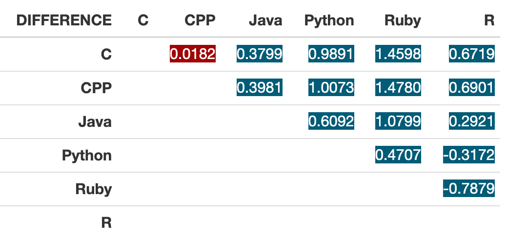

---
# This template is largely functionally equivalent to that for elsevier
# The two fields that are not in the elsevier format are:
#      `corresponding_author` and `acknowledgements`
title: STA2005S - Experimental Design Assignment
date: "`r Sys.Date()`"
author:
  - name: Jing Yeh
    email: yhxjin001@myuct.ac.za
  - name: Saurav Sathnarayan
    email: sthsau01001@myuct.ac.za

bibliography: mybibfile.bib
nocite: '@*'

abstract: In this report, we explore the efficiency of 6 programming languages through the approximation of $\pi$. We found that C and C++ are the most efficient programming languages, and show case evidence for compiled languages having better performance than interpreted languages. Our results suggest that programmers will benefit from taking the efficiency of various programming languages into account, rather than simply opting for simplicity in syntax .
  
# Use a CSL when `citation_package = "default"`
#csl: https://www.zotero.org/styles/oxford-university-press-note

## Example of some pandoc's variable to use
#fontsize: 12pt
#spacing: halfline # could also be oneline
#classoptions:
#  - endnotes
#link-citations: yes
#urlcolor: orange
#linkcolor: green
#citecolor: red
header-includes:
 \usepackage{float}
 \floatplacement{figure}{H}
  \usepackage{caption}
  \captionsetup[figure]{font=scriptsize}
#  - \usepackage[nomarkers,tablesfirst]{endfloat} # For figures and tables at end
#  - \usepackage{lineno} # For line numbering
#  - \linenumbers # For line numbering

output:
    rticles::oup_article:
    oup_version: 0 # 1 = 2020 CTAN OUP CLS package; 0 = 2009 OUP CLS package
    extra_dependencies: booktabs # for kable example
    
---

```{r setup, include = FALSE, warning=FALSE}
knitr::opts_chunk$set(
  echo = FALSE, # By default, hide code; set to TRUE to see code
  fig.pos = 'H', 
  out.width = '100%', dpi = 300, # Figure resolution and size
  fig.env = "figure", # Latex figure environment,
  warining=FALSE,
  message = FALSE)
library(tidyverse)
library(scales)
library(gridExtra)
library(knitr)
library(kableExtra)
library(xtable)
library(formattable)
options(xtable.comment = FALSE)
```
\newpage

# Introduction
Computation has played a major role in human history ever since people
began living in cities. The need to calculate taxes motivated the
invention of various computing devices that aided such computations,
such as the Sumerian abacus, invented in Babylon at around
2500BC [7]. In the 21st century, the capability of our digital computing
devices have vastly surpassed the capacity of those proto-computers, but
so has our need for computational power. Everything in our daily life
requires some form of computers: from our phones, cars, to even our
refrigerators (side note: initially, Java was invented for
refrigerators).

However, with large computation capability comes complexity in the
design of these devices: to speak plainly, they are damn difficult to
use. Computer scientists have therefore invented numerous
\emph{programming languages} that allow us to harness the power of these
devices more easily.

Nowadays, programming languages have become the primary medium for
instructing computers to perform our increasingly complex tasks.
Understanding which programming languages offer superior execution speed
is therefore crucial for developers, especially in domains requiring
real-time processing, large-scale data analysis, and other
resource-intensive computations. The goal of this experiment is to
identify such languages that deliver the fastest execution time.

## Compiled vs Interpreted Languages
In a compiled language, the source code is translated into machine code by a compiler before execution, which produces an executable that can be run directly by the machine. In an interpreted language, however, the source code is executed line-by-line by its interpreter at runtime. The interpreter reads the code, translates it into machine code, and executes it all at once. This machine code, often called an executable, can be run directly by the computer's hardware. Compiled languages tend to have better performance due to the pre-compiled nature of the code, whereas interpreted languages are more flexible but slower due to the runtime translation

Examples: C, C++, Rust, and Java are examples of compiled languages. Python, JavaScript, Ruby, and R are examples of interpreted languages.
\newpage

## Distribution of Execution Times (Pilot Experiment Part 1):
Since existing literature on the execution times of programming languages when applying Leibniz's formula is limited, we conducted a mini pilot experiment on a single machine to gauge the execution times for the programming languages we planned on experimenting with. We performed 500 approximations using the algorithm for each programming language and obtained the following jittered graph.
```{r echo=FALSE, figPrior, fig.cap="Runtimes of Programming Languages of Interest When Applying Leibniz's Formula up to 100 million terms", fig.width=8.5}
setwd("./speed-comparison-master/data/")
middleTRNew.before <-read.csv("middleTRNew/middleTRNewBefore.csv")
middleTRNew.before.long <- pivot_longer(middleTRNew.before, cols=everything(), names_to="language", values_to="runtime")
jitter <- ggplot(middleTRNew.before.long, aes(x=language, y=log(runtime), color=language))+
  geom_point(alpha=0.3, position=position_jitter(height=1, width=0.3))+
  labs(x="language", y="runtime (log(ms))", title="Jittered Graph of Execution Time", size=8)

qq <- ggplot(middleTRNew.before.long, aes(sample=log(runtime)))+
  geom_qq(col="green")+
  geom_qq_line(col="blue")+
  facet_wrap(~language, scales="free")+
  labs(x="quantiles", y="runtime (log(ms))", title="Quantile-Quantile Plots of Execution Time",
       size=8)
grid.arrange(jitter, qq, ncol=2, nrow=1)
```
We can observe that C and C++ seem to be the fastest languages on this particular machine, though further analyses are needed. We can also see from the Quantile-Quantile(Q-Q) plots that the execution times are clearly not normally distributed.
\newpage

# Methods
## Setting
This study was mostly conducted at the University of Cape Town, utilising the computers available on campus. We found that there are only 5 different hardware setups available. Thus, to supplement the range of our hardware setups, we also borrowed machines of 2 more hardware setups from our friends.

## Approximation of $\pi$
The number $\pi$, the ubiquitous and equally mysterious irrational number, has been fascinating the humankind since time immemorial. Mathematicians from 4000 years ago to the present day have devised various methods to get closer to the true value of $\pi$. One such method is using Leibniz's formula:
$$
4 \left( 1 - \frac{1}{3} + \frac{1}{5} - \frac{1}{7} + \frac{1}{9} ±... \right) = \sum_{k=0}^{\infty}\frac{(-1)^k}{2k+1}
$$
Leibniz, whom the formula is named after, proved that the series above eventually converges to $\pi$. That is:
$$
\pi = 4 \left( 1 - \frac{1}{3} + \frac{1}{5} - \frac{1}{7} + \frac{1}{9} ±... \right) = \sum_{k=0}^{\infty}\frac{(-1)^k}{2k+1}.
$$
We applied this algorithm in 6 programming languages, including 3 compiled languages: C, C++, Java, and 3 interpreted languages: Python, R, Ruby, up to a $100 \times 10^6$ terms.


## Sampling Procedure
Existing literature suggests that execution times of programming languages are typically not normally distributed [10]. We confirmed this in part I of our pilot experiment that none of our languages has normally distributed runtime when performing the algorithm. This is an issue as it prevented us to apply anova models. To address this, we applied the Central Limit Theorem(CLT) to obtain a normal distribution for the average execution times. We ran the program 15 times per sample for each programming language, and repeated the process 30 times. Applying CLT, it is relatively safe to assume the distribution of sample means is approximately normal [2]. If we assume sample means to be normally distributed, the mean of the distribution of sample means is then an unbiased estimator for the true run time of each programming language[2], which we will take as a single observation. (Note: We arrived at the number 15 through trial and error, and 30 from [8])

## Sources of Variation

#### Treatments:
We have 6 treatment factors, which are the programming languages we applied the algorithm to. Each treatment has one level (applying the formula up to $100 \times 10^6$ terms). We selected this particular level because it is the largest, practical number of terms we could apply with our hardware setups (For some setups, it may take up to 4 hours to arrive at a single observation), and fewer terms imply larger relative measurement error [7]. We cannot include more levels because in the existing literature, most studies of such kind choose to run all languages on the same machine. However, since we would like to avoid pseudo replication as much as possible we used one machine per observation. The downside of this approach is that we do not have sufficient machines to perform more than one levels.

#### Blocks: 
We know that the hardware setup of a computer can significantly affect its speed, and therefore the execution time of our algorithm. We also know that, two computers with the same hardware setup should have relatively the speed, provided that they run on the same operating system, and no major damage has been done to either of them. This motivated us to block for the hardware setup of computers, our experimental units.

## Experimental Units: 
As mentioned earlier, we would like to avoid pseudo replication as much as possible. Therefore, we deviated from the tradition of running all programming languages on the same machine, and test only one language per machine. Our experimental units are therefore the individual machines we ran each test on.

## Randomisation Procedure
We first ordered the computers belonging to each block from 1 to 6. We then used the random number generator from Python's _random_ module to randomly shuffle, and thus producing a permutation of the list, [C, C++, Java, Python, Ruby, R]. The index of each programming language in the permutation would then be paired to the computer with the same assigned number.

## Planned Comparisons
We planned to conduct pairwise comparisons on all treatments. That is, a total of $6 \choose 2 = 15$ comparisons. We assume this would help us find the most efficient language(s). It would also serve our interest by comparing the efficiency of compiled languages (C, C++, Java) and interpreted languages (Python, Ruby, R), as the latter are oftentimes easier to program with. This allows us to better asses the time-cost trade off of these programming languages.

## Pilot Experiment Part II
We followed this direction and performed part II of our pilot study to obtain the following execution times of programming languages on 4 hardware setups
```{r echo=FALSE, figPilot, fig.cap="Interaction Graph of Programming Languages and Blocks", fig.height=2, warning=FALSE}
setwd("./speed-comparison-master/data/")

pilot <- read.csv("pilotData.csv")
pilot.long <- pivot_longer(pilot, cols=C:R, names_to = "language", values_to = "runtime")
plot <- ggplot(pilot.long, aes(x=language, y=log(runtime), group=Hardware, color=Hardware))+
  geom_point()+
  geom_line()+
  labs(title= "Interaction Graph",
       x= "Progamming Language",
       y= "Runtime (log(ms))")
plot
```

From the data collected, we observed that the results collected from Ishango do not follow the general trends established by the other three setups. Firstly, the hardware setup in Ishango lab is significantly less advance than MiddleTRNew. Yet, most programming languages tend to perform better on the Ishango machine. Secondly, to add to the first observation, not all programming languages perform better on the Ishango machine.

After further investigation, we learned that programming languages perform differently on various operating systems [4]. We hypothesised that this is the main reason for the deviation, though further studies are needed to confirm this (we lack access to machines with the same hardware setup but run on different operating system).

Therefore, we added another constraint for selecting suitable machines: the machines must all run on Windows 10, as these machines are the most widely available. Other than than that, the results verified our motivation for blocking various hardware setups.

## Design
We assume that:
$$
e_{ij} \sim \mathcal{N}(0, \sigma^2)
$$ 
We use the following anova model for our response variables:

$$
Y_{ij} = \mu + \alpha_i + \beta_j+ e_{ij}
$$
$$
i = 1 ...a
$$
$$
j = 1 ...b
$$
With the following constraints:
$$
\sum_{i=1}^a \alpha_i = \sum_{j=1}^b \beta_i =0 
$$
Where:
$$
\begin{aligned}
&\mu\hspace{35pt}  \text{overall mean} \\
&\alpha_i\hspace{35pt} \text{effect of }\, i^{th}\, \text{treatment}\\
&\beta_j\hspace{35pt} \text{effect of }\, j^{th}\, \text{block}\\
&e_{ij}\hspace{35pt} \text{random error of the observation}\\
\end{aligned}
$$

We also assume that each $e_{ij}$ is independent to each other, which allows us to assume that each $Y_{ij}$ is also independent to each other, and are normally distributed. If there are no blocking and treatment effects, then:
$$
Y_{ij} \sim \mathcal{N}(\mu, \sigma^2)
$$
Otherwise, if there are blocking and treatment effects, then:
$$
Y_{ij} \sim \mathcal{N}(\mu + \alpha_i + \beta_j, \sigma^2)
$$
Below is the layout of the design
```{r echo=FALSE, results='asis', fig.cap="Diagram of the Design"}
knitr::include_graphics("diagram.png")
```
\newpage
# Results
We performed the experiment described above on 7 different hardware setups and applied all 6 treatments. Detailed tables for data and for hardware setups can be found in the appendix. The Analysis of Variance (ANOVA) table is shown below:
```{r, figAnova, fig.cap="Diagnostic Plots", results='asis', warning=FALSE, out.width="400px", fig.height=4, fig.align="center"}
setwd("./speed-comparison-master/data/")

analysis <- read.csv("analysis.csv")
#analysis.long <- pivot_longer(analysis, cols=C:R, names_to = "language", values_to = "runtime")
analysis.long <- pivot_longer(analysis, cols=C:R, names_to = "Language", values_to = "Runtime")
anova_log <- aov(log(Runtime)~Language + Hardware, analysis.long)
frame <- data.frame(summary(anova_log)[[1]])
colnames(frame) <- c("Df", "Sum sq", "Mean sq", "F value", "Pr(>F)")
frame$'Pr(>F)' <- ifelse(is.na(frame$'Pr(>F)'), "", '< 0.0001')
frame$'F value' <- as.numeric(frame$'F value')
frame$'F value' <- ifelse(is.na(frame$'F value'), "", round(frame$'F value', digits=4) )

kable(frame, format="pandoc", escape=FALSE, digits=4, align=c("r", "r", "r", "r", "r", "r"), caption="Analysis of Variance Table")

analysis_interaction <- ggplot(analysis.long, aes(x=Language, y=log(Runtime), group=Hardware, color=Hardware))+
  geom_point()+
  geom_line()+
  labs(title= "Interaction Graph",
       x= "Language",
       y= "Runtime (log(ms))")+
  theme(
    legend.text = element_text(size = 5),
    legend.title = element_text(size = 0),
    legend.key.size = unit(0.1, "cm"),
    legend.position = "bottom",
    legend.margin=unit(-1,"cm"),
    axis.title = element_text(size=8)
    )+
  guides(color = guide_legend(override.aes = list(size = 0.5)))
  
  

anova_log.residauls <- resid(anova_log)
anova_qq <- ggplot(data.frame(anova_log.residauls), aes(sample=(anova_log.residauls)))+
  geom_qq(col="firebrick", size=2)+
  geom_qq_line(col="deepskyblue4", alpha=0.75)+
  labs(x="Quantile", y="Runtime log(ms)", title="Quantile-Quantile")
  

anova_residuals_fitted <- ggplot(anova_log,aes(x=fitted(anova_log), y=anova_log.residauls))+
  geom_point(col="firebrick")+
  geom_smooth(col="deepskyblue4",alpha=0 )+
  labs(x="Fitted", y="Residuals (log(ms))", title="Residuals vs Fitted")

analysis_box <- ggplot(analysis.long, aes(x=Language, y=log(Runtime)))+
  theme_minimal()+
  geom_boxplot(color="red3", fill = "deepskyblue4", lwd=0.4)+
  labs(x="Language", y="Runtime (log(ms))", title="Box Plot of Execution Time")+
  theme(
    axis.title = element_text(size=8)
  )


grid.arrange(anova_qq, anova_residuals_fitted, analysis_box, analysis_interaction, layout_matrix = rbind(c(1,1, 1,3, 3), c(2,2,2,4 ,4)))
```
## Verifying Model
We verified our model by observing the Fitted vs Residuals graph: the residuals seem to be randomly spread, with no obvious patterns to be discerned. This shows that assuming homoscedasticity (equal variance) is not non-sensical [7]. Also, the Quantile-Quantile graph offers a fairly good fit, providing evidence for residuals being normally distributed.

We further verified our assumptions by performing Shapiro Wilk test to test against the normality assumption of residuals. We obtained a fairly large p-value of 0.7521, indicating that we have little evidence to suggest otherwise. Further, we also got that the mean of the residuals is extremely closed to zero ( $< 10^{-15}$ ), indicating that it is sensible to assume $e_{ij} \sim \mathcal{N}(0, \sigma^2)$

## Pairwise Comparisons
```{r, tableMeans, fig.cap="Table of Treatment Means in log(ms)", warning=FALSE}
setwd("./speed-comparison-master/data/")
analysis_mean = read.csv("analysis_mean.csv")
kable(data.frame(analysis_mean), format="pandoc", caption="Table of Treatment Means in log(ms)", align=c("c","c","c","c","c","c"), digits=4)
```

Given that we know our response variables are normally distributed, we opted for the more powerful Tukey's Method rather than Scheffe's to construct 95% confidence intervals that compare the execution time of every possible pair of our 6 programming languages. Sine we know the estimate of the standard deviation of residuals, we can estimate the standard error (SE) of our treatment means, and then use it to deduce Tukey's Honestly Significant Difference(HSD): 
$$
\begin{aligned}
SE &= \frac{s}{\sqrt{b}}\\
&= \frac{0.0456}{\sqrt{13}}\\\\
HSD &= q_{6,30}^{0.05} \frac{s}{\sqrt{b}}\\
&= 4.3015 \times \frac{\sqrt{0.0456}}{\sqrt{13}}\\
&= 0.2535
\end{aligned}
$$
```{r echo=FALSE, tableTukey, fig.cap="Results of Tukey's Honestly Significance Difference Test. Values Greater than HSD are Highlighted in Blue",fig.align = "center", out.height="150px", out.width="300px"}

```
We can see from the table of Tukey's HSD tests at 95% confidence level that C and C++ have the fastest execution times than others when performing the algorithm up to $100 \times 10^6$ terms. The results can be summarised as follows:
$$
t(C) \approx t(C++) < t(Java) < t(R) < t(Python) < t(Ruby)
$$
The p-values for comparatively more significant results (p-value > 0.005) are given below:\
  - R vs Python: 0.0173\
  - R vs Java: 0.0080
  
## Compiled vs Interpreted
We were also interested in comparing the execution times of compiled languages and interpreted languages. The contrast, _L_, can be stated as follows:
\begin{align*}
L &= \frac{1}{3} (\mu_C + \mu_{C++} + \mu_{Java}) - \frac{1}{3}(\mu_{Python} + \mu_{Ruby} + \mu_{R})\\
\intertext{We can estimate the values relevant to the contrast as follows:}
\hat{L} &= \frac{1}{3} (\bar{y}_C + \bar{y}_{C++} + \bar{y}_{Java}) - \frac{1}{3}(\bar{y}_{Python} + \bar{y}_{Ruby} + \bar{y}_{R})\\
&= -0.9198 \\
\widehat{Var(\hat{L})} &= s^{2} \sum_{i=1}^{6} \frac{{h_i}^2}{n}\\
&= 0.0456\sum_{i=1}^{6}\frac{\frac{1}{9}}{7}\\
&= 0.004343\\
SE(\hat{L}) &= \sqrt{\widehat{Var(\hat{L})}}\\
 &= \sqrt{0.004343}\\
 &= 0.0659
\end{align*}
We first note that \(t_{0.025}^{30} = 2.0422\). We will then construct a 95\% confidence interval as follows:
\begin{align*}
\hat{L}&\pm SE(\hat{L})\times t_{0.025}^{30}\\
-0.9198 &\pm 0.0659 \times 2.0422\\
\intertext{Thus, the 95\% Confidence interval is as follows: }
95\%C.I. &= (-1.0544 ,-0.7852)
\end{align*}

The mean log execution time of compiled languages is estimated to be -1.05 log(ms) to -0.79 log(ms) shorter than the mean log execution time of interpreted languages at 95% confidence level. We therefore have strong evidence to suggests that compiled languages have shorter execution times when applying Leibniz's formula up to a very large term.
\newpage

# Discussion

The experiment aimed to analyze the execution time of different programming languages when applying Leibniz’s formula across 7 hardware setups and 6 treatments. The ANOVA results indicate significant differences amongst the execution times of various languages. The p value for hardware is also very low (< 0.0001) which indicates that hardware setup does have an effect on the execution time of different programming languages.
\
From the Tukey's HSD post-hoc tests, it is clear that C and C++ have the fastest execution times, as reflected by their significantly lower mean execution times compared to other languages. The compiled languages (C, C++) outperformed Java, R, Python, and Ruby, suggesting a performance gap that favors compiled over interpreted languages. Java, a semi-compiled language, performed moderately well, trailing behind C and C++ but significantly ahead of interpreted languages like Python and Ruby.
\
We also collected strong evidence to suggest differences in the performance of compiled and interpreted languages. The estimated log execution times show a distinct advantage for compiled languages, with a difference of -1.05 log(ms) to -0.79 log(ms), further validating that compiled languages tend to be faster.
\
The ANOVA diagnostic plots (quantile-quantile and residuals vs. fitted) indicate a well-fitted model, with residuals demonstrating no major deviations from normality and homoscedasticity, supporting the robustness of the analysis.
\
Based on the results, we strongly recommend programmers to take the efficiency of various programming languages into account when selecting one for their project. 


# Conclusion:
The results of this experiment confirmed that compiled languages (C and C++) exhibit significantly faster execution times compared to both semi-compiled (Java) and interpreted languages (R, Python, Ruby). The performance gap between compiled and interpreted languages becomes particularly evident with large-scale computations, such as Leibniz’s formula for a billion terms. Based on the ANOVA and post-hoc analysis, we can conclude with 95% confidence that compiled languages provide a substantial performance advantage over interpreted languages for this computational task. These findings can be useful for developers when choosing a programming language for performance-critical applications, especially those involving large iterative computations.

\newpage

# Appendix
#### PC Specificiations
\
```{r echo=FALSE, results='asis'}
dfpc <- read.csv('pcSpecs.csv',header = TRUE)
print(xtable(dfpc, type = "latex", comment = FALSE, caption = 'Table of Pcs used and their respective specifications'))
```


```{r echo=FALSE, results='asis', warning=FALSE}
setwd("./speed-comparison-master/data/")
dfdata <- read.csv('analysis_log.csv',header = TRUE)
print(xtable(dfdata, type = "latex", comment = FALSE, caption = 'Table of data used for analysis'))
```
```{r echo=FALSE}
TK <- TukeyHSD(anova_log)
kable(TK$Language, digits = 6) |>
  kable_styling(font_size=9) |>
  footnote(general="Table 5: Table of Differences in Log Execution Time with Tukey's Method", general_title = "")
```

\newpage
# References
```{r, include = FALSE}
knitr::write_bib(x = c("rmarkdown", "knitr"), file = "mybib.bib")
```


